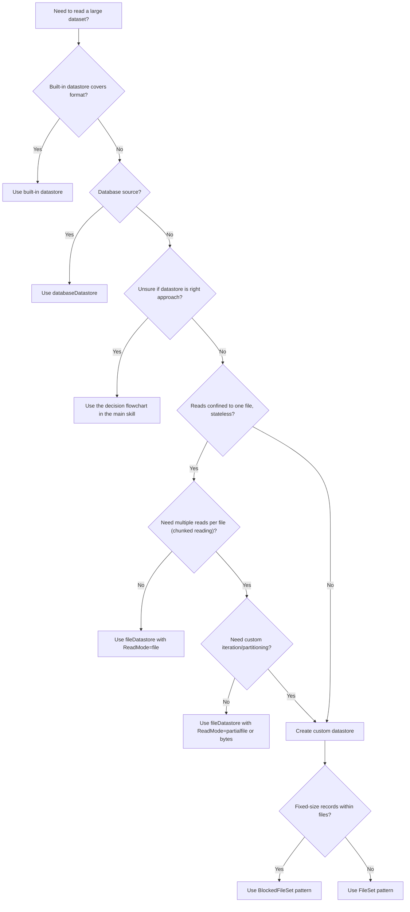

# Create Custom Datastore

Build custom datastore classes that integrate correctly with MATLAB's datastore
ecosystem (tall, parallel, readall, preview).

## When to Use

- The task involves reading a proprietary or non-standard file format via datastores
- The task requires subclassing `matlab.io.Datastore`
- A datastore is needed that works with `tall` or parallel pools
- The task references `FileSet`, `BlockedFileSet`, `DsFileSet`, `DsFileReader`, or extensible datastores

## When NOT to Use

- Built-in datastores cover the format: `tabularTextDatastore` (CSV/text),
  `parquetDatastore` (Parquet), `imageDatastore` (images),
  `audioDatastore` (audio), `fileDatastore` (generic files)
- User wants to read from a database — use `databaseDatastore` instead
- The task involves tall array algorithms or operations on an existing datastore — this reference only covers creating the datastore class itself
- A custom datastore already exists and the task is to use it

## Decision Flowchart



## Custom Datastore vs FileDatastore

| | `fileDatastore` | Custom datastore |
|--|-----------------|------------------|
| **Use when** | One file = one read, or simple partial reads via `ReadMode` | Stateful reads, non-file sources, or custom iteration/partitioning |
| **Effort** | Minimal — just supply a reader function | Full class implementation |
| **Flexibility** | File-per-read or partial reads (`ReadMode="partialfile"` or `"bytes"`) | Complete control over read granularity and state |

If the user's format can be read with a single function call per file (e.g.,
`load`, `imread`, `jsonread`), recommend `fileDatastore` with a custom
`ReadFcn` first. Set `UniformRead=true` at construction so that `readall`
returns a concatenated table instead of a cell array (`UniformRead` is
read-only after construction).

```matlab
fds = fileDatastore("data/*.json", ...
    ReadFcn=@(f) struct2table(jsondecode(fileread(f))), ...
    UniformRead=true);
results = readall(fds);  % single concatenated table
```

For multiple reads per file (chunked reading), `fileDatastore` with
`ReadMode="partialfile"` supports stateful iteration within each file. The
`ReadFcn` signature changes to 2 inputs and 3 outputs:

```matlab
% [data, userdata, done] = readFcn(filename, userdata)
% - First call: userdata is []
% - Set done=true on the last chunk to advance to the next file
fds = fileDatastore("data/*.bin", ...
    ReadMode="partialfile", ...
    ReadFcn=@myChunkedReader);
```

Only escalate to a custom datastore class when `fileDatastore` patterns are
insufficient (e.g., custom partitioning, non-file sources, or complex state).

## Workflow

### 1. Gather Requirements

**STOP — do not write any code until this step is complete.**

Before writing any code, determine which mixins and file management utility to
use. Follow this decision process:

1. **Check if requirements are already specified** — if the prompt explicitly
   states mixin needs (e.g., "I need tall array support", "use defaults for
   everything else", "no parallel needed"), use them directly. Phrases like
   "use defaults" or "defaults are fine" count as explicit specification.
2. **Detect automatically** — run `version` in MATLAB to determine the
   installed release, if MATLAB is available.
3. **Ask the user** — if the prompt does NOT explicitly address tall/parallel
   support or other mixin needs, you MUST ask before implementing. Present the
   unresolved questions as a checklist and wait for answers. Do not silently
   apply defaults — the user needs to confirm their requirements.

**When to ask vs. when to proceed:**
- Prompt says nothing about tall, parallel, partition, shuffle, Hadoop, or
  write → **ask** about at minimum: (1) tall/parallel support, and
  (2) whether Shuffleable, HadoopLocationBased, or FileWritable are needed.
- Prompt explicitly states requirements or says "use defaults" → **proceed**
  without asking.
- User says "don't ask questions" or requirements are fully specified →
  **proceed** without asking.

**Sub-agent mode only:** If there is no human in the loop (e.g., you are a
sub-agent in an automated pipeline), apply the defaults shown below for any
unresolved questions instead of asking. Even in sub-agent mode, you MUST still
present the full list of requirement decisions: state which mixins you are
including, which you are declining, and why. Explicitly mention Partitionable,
Shuffleable, HadoopLocationBased, and FileWritable in your decision summary.

**MATLAB version:**

| Question | Why it matters |
|----------|----------------|
| What MATLAB version are you targeting? (Run `version` in MATLAB if available; default to R2021a if undetermined.) | Determines available classes (`Subsettable` requires R2022b+). This reference requires R2021a or later. |

**Mixins (superclasses):**

Note: `matlab.io.Datastore` already inherits from `matlab.mixin.Copyable` — do
not add it separately. The `copyElement` method is always required (see Step 3).

| Mixin | Question | Default |
|-------|----------|---------|
| `matlab.io.datastore.Partitionable` | Do you need tall array or parallel computing support? | **Yes** |
| `matlab.io.datastore.Subsettable` | Do you need to extract non-adjacent or specific data slices by index, randomized shuffling, or parallel minibatch processing? (R2022b+; requires every read to be independently addressable) | No. Subsumes `Partitionable` and `Shuffleable` — do not add those separately if using this. |
| `matlab.io.datastore.HadoopLocationBased` | Does the data live on HDFS or need Hadoop/Spark? | No |
| `matlab.io.datastore.Shuffleable` | Do you need random shuffling for deep learning training? (Not needed if using `Subsettable`) | No |
| `matlab.io.datastore.FileWritable` | Does the datastore need to write data back to files? | No |
| `matlab.io.datastore.FoldersPropertyProvider` | Do you need a Folders property for folder-based access or writing? | No |

**File management utility (pick one — used internally, not inherited):**

| Utility | Question | Default |
|---------|----------|---------|
| `matlab.io.datastore.FileSet` | Is each file one observation (whole-file reads)? | **Yes** (R2020a+) |
| `matlab.io.datastore.BlockedFileSet` | Are there fixed-size records/blocks within files? | No (R2020a+) |

**Auto-inference rules** — select automatically and inform the user:
- Data is large relative to memory → include `Partitionable`
- User needs non-adjacent data slices by index, randomized shuffling, or parallel minibatch processing AND R2022b+ AND every read is independently addressable → include `Subsettable` instead of `Partitionable` and `Shuffleable`
- File paths use HDFS URIs (`hdfs://`) → include `HadoopLocationBased`
- User mentions deep learning or training AND not using `Subsettable` → include `Shuffleable`
- Data spans multiple folders or datastore needs write support → include `FoldersPropertyProvider`
- User needs `writeall` or export → include `FileWritable`
- Fixed-size records packed sequentially in files → use `BlockedFileSet`
- User targets < R2022b → cannot use `Subsettable`

### 2. Select Class Hierarchy

Based on requirements, construct the classdef line:

```matlab
% Minimum (always include Partitionable unless user explicitly declines):
classdef MyDatastore < matlab.io.Datastore & ...
        matlab.io.datastore.Partitionable
```

See `references/custom-datastore/mixin-decision-tree.md` for the full
combination table and required methods per mixin.

### 3. Implement the Datastore

Follow this layered approach — implement serial first, then add parallel/other:

**Always required (serial foundation):**
- `hasdata` — check `CurrentFileIndex <= obj.FileSet.NumFiles`
- `read` — load data from `obj.FileSet.FileInfo.Filename(CurrentFileIndex)`, advance index
- `reset` — set `CurrentFileIndex = 1`
- `progress` (Hidden) — compute `(CurrentFileIndex-1)/obj.FileSet.NumFiles`
- `copyElement` (protected) — deep copy `FileSet` via `copy(obj.FileSet)`. Always required because `readall` and `preview` internally copy the datastore.

**If fixed-size block reads are needed (records within files):**
- Use `BlockedFileSet` instead of `FileSet`
- `hasdata` — delegate to `hasNextBlock(obj.BlockedFileSet)`
- `read` — use `nextblock` to get offset/size, then call the custom read function
- `reset` — delegate to `reset(obj.BlockedFileSet)`

**If Partitionable:**
- `partition` (public) — `copy` self, then `partition(obj.FileSet, n, idx)`
- `maxpartitions` (protected) — delegate to `maxpartitions(obj.FileSet)`

**If Subsettable (R2022b+, use instead of Partitionable when fine-grained subsetting is needed):**
- `maxpartitions` (protected) — return total number of independent reads (e.g., `obj.FileSet.NumFiles`)
- `subsetByReadIndices` (protected) — copy self, keep only the reads at given indices (e.g., rebuild FileSet from indexed file list)
- Do NOT also implement `partition` or `shuffle` — `Subsettable` provides them automatically
- Do NOT also inherit from `Partitionable` or `Shuffleable`

**If HadoopLocationBased:**
- `initializeDatastore` (Hidden) — rebuild FileSet from Hadoop info struct
- `getLocation` (Hidden) — return `obj.FileSet`
- `isfullfile` (Hidden, optional) — check `obj.FileSet.FileSplitSize == 'file'`

**If Shuffleable (not needed if using Subsettable):**
- `shuffle` — copy self, randomize file order

### 4. Qualify via Tests

After implementation, write and run tests. See `references/custom-datastore/testing-guidelines.md`
for the required test patterns. At minimum, verify:

- `readall` returns all data without advancing the original position
- `preview` returns data from the beginning without affecting state
- `reset` returns to the start after partial reads
- `hasdata` transitions from true to false correctly
- `partition` creates valid sub-datastores that sum to the whole (if Partitionable)
- `tall` construction works without error (if Partitionable)

Run tests via `mcp__matlab__run_matlab_test_file` and fix any failures before
reporting the implementation as complete.

## FileSet vs BlockedFileSet

| Feature | `FileSet` | `BlockedFileSet` |
|---------|-----------|-----------------|
| **Use when** | Each file = one observation (whole-file reads) | Fixed-size records packed within files |
| File listing | `fs.FileInfo.Filename` | `fs.FileInfo.Filename` |
| Count | `fs.NumFiles` | `fs.NumBlocks` (may overcount; use iteration) |
| Iteration | `hasNextFile`/`nextfile` | `hasNextBlock`/`nextblock` |
| Block info | N/A — full file path only | `BlockInfo` with `Filename`, `Offset`, `BlockSize` |
| Partitioning | `partition(fs, n, idx)` | `partition(fs, n, idx)` |
| Reading | Custom reader function (format-specific) | Custom reader function (typically `fopen`/`fseek`/`fread` internally) |

**Choose `FileSet`** when each file is one logical observation (most common).
**Choose `BlockedFileSet`** when data consists of fixed-size records packed
sequentially in files and you need block-level iteration and partitioning.

## Patterns

### Base Datastore with FileSet (Default Pattern)

This is the correct starting point for most custom datastores. Each file is
read as one observation:

```matlab
classdef MyDatastore < matlab.io.Datastore & ...
        matlab.io.datastore.Partitionable

    properties (Access = private)
        CurrentFileIndex (1,1) double = 1
        FileSet matlab.io.datastore.FileSet
    end

    properties (Dependent)
        Files
    end

    methods
        function ds = MyDatastore(location)
            arguments
                location (1, :) {mustBeText}
            end
            ds.FileSet = matlab.io.datastore.FileSet(location, ...
                "IncludeSubfolders", true, ...
                "FileExtensions", ".bin");
            reset(ds);
        end

        function files = get.Files(ds)
            files = ds.FileSet.FileInfo.Filename;
        end

        function tf = hasdata(ds)
            tf = ds.CurrentFileIndex <= ds.FileSet.NumFiles;
        end

        function [data, info] = read(ds)
            if ~hasdata(ds)
                error("MyDatastore:NoData", ...
                    "No more data. Use reset to start over.");
            end
            filepath = ds.Files(ds.CurrentFileIndex);
            data = readMyFormat(ds, filepath);

            info.Filename = filepath;
            info.FileSize = ds.FileSet.FileInfo.FileSize(ds.CurrentFileIndex);
            ds.CurrentFileIndex = ds.CurrentFileIndex + 1;
        end

        function reset(ds)
            ds.CurrentFileIndex = 1;
        end

        function subds = partition(ds, numPartitions, index)
            subds = copy(ds);
            subds.FileSet = partition(ds.FileSet, numPartitions, index);
            subds.CurrentFileIndex = 1;
        end
    end

    methods (Hidden)
        function frac = progress(ds)
            frac = (ds.CurrentFileIndex - 1) / ds.FileSet.NumFiles;
        end
    end

    methods (Access = protected)
        function n = maxpartitions(ds)
            n = ds.FileSet.NumFiles;
        end

        function dsCopy = copyElement(ds)
            dsCopy = copyElement@matlab.mixin.Copyable(ds);
            dsCopy.FileSet = copy(ds.FileSet);
        end
    end

    methods (Access = private)
        function data = readMyFormat(~, filepath)
            % --- Format-specific reading logic here ---
        end
    end
end
```

### Block-Based Datastore with BlockedFileSet

Use this pattern when data consists of fixed-size records packed sequentially
in files. Each `read` returns one block of data.

```matlab
classdef MyBinaryDatastore < matlab.io.Datastore & ...
        matlab.io.datastore.Partitionable

    properties (Access = private)
        BlockedFileSet matlab.io.datastore.BlockedFileSet
        CurrentBlockIndex (1,1) double = 0
        TotalBlocks (1,1) double = 0
    end

    methods
        function ds = MyBinaryDatastore(location, blockSize)
            arguments
                location (1, :) {mustBeText}
                blockSize (1,1) double = 100
            end
            ds.BlockedFileSet = matlab.io.datastore.BlockedFileSet(location, ...
                "FileExtensions", ".bin", "BlockSize", blockSize);
            ds.TotalBlocks = countBlocks(ds);
            reset(ds);
        end

        function tf = hasdata(ds)
            tf = hasNextBlock(ds.BlockedFileSet);
        end

        function [data, info] = read(ds)
            if ~hasdata(ds)
                error("MyBinaryDatastore:NoData", ...
                    "No more data. Use reset to start over.");
            end
            blkInfo = nextblock(ds.BlockedFileSet);
            data = myBlockReader(ds, blkInfo);
            info.Filename = blkInfo.Filename;
            info.Offset = blkInfo.Offset;
            info.BlockSize = blkInfo.BlockSize;
            ds.CurrentBlockIndex = ds.CurrentBlockIndex + 1;
        end

        function reset(ds)
            reset(ds.BlockedFileSet);
            ds.CurrentBlockIndex = 0;
        end

        function subds = partition(ds, numPartitions, index)
            subds = copy(ds);
            subds.BlockedFileSet = partition(ds.BlockedFileSet, numPartitions, index);
            subds.TotalBlocks = countBlocks(subds);
            reset(subds);
        end
    end

    methods (Hidden)
        function frac = progress(ds)
            if ds.TotalBlocks == 0
                frac = 1;
            else
                frac = ds.CurrentBlockIndex / ds.TotalBlocks;
            end
        end
    end

    methods (Access = protected)
        function n = maxpartitions(ds)
            n = maxpartitions(ds.BlockedFileSet);
        end

        function dsCopy = copyElement(ds)
            dsCopy = copyElement@matlab.mixin.Copyable(ds);
            dsCopy.BlockedFileSet = copy(ds.BlockedFileSet);
        end
    end

    methods (Access = private)
        function data = myBlockReader(~, blkInfo)
            % --- Block reading logic here (e.g., fopen/fseek/fread) ---
        end

        function n = countBlocks(ds)
            bfsCopy = copy(ds.BlockedFileSet);
            reset(bfsCopy);
            n = 0;
            while hasNextBlock(bfsCopy)
                nextblock(bfsCopy);
                n = n + 1;
            end
        end
    end
end
```

**Why `countBlocks` instead of `NumBlocks`:** `BlockedFileSet.NumBlocks` may
overcount (includes phantom trailing blocks). Iterating gives the true count
that matches what `hasNextBlock`/`nextblock` will produce.

### Writing the Custom Read Function

The `read` method is the custom read function — it contains the format-specific
parsing logic. Helper methods (like `readMyFormat` or `myBlockReader` in the
patterns above) are optional but useful for isolating the parsing from the
datastore plumbing.

**Key design decisions to resolve:**
- What is the file format? (binary with header, delimited text, structured records, etc.)
- Does the format support offset-based reading (for sub-file splits)?
- What MATLAB type should the output be? (table, numeric array, struct, etc.)

**When blocks are NOT feasible** (format has headers, variable-length records,
or records don't align to byte boundaries):
- Use `FileSet` — each file is read whole

## Common Mistakes

| Mistake | Why It's Wrong | Correct Approach |
|---------|---------------|-----------------|
| Using `DsFileSet` or `DsFileReader` | Legacy classes; not recommended for new code | Use `FileSet` for whole-file reads, `BlockedFileSet` for fixed-size blocks |
| Omitting `copyElement` | `readall` and `preview` share state with the original; mutations corrupt the datastore | Always implement `copyElement` with `copy(ds.FileSet)` or `copy(ds.BlockedFileSet)` |
| Making `maxpartitions` public | Violates superclass contract; MATLAB may error | Must be `methods (Access = protected)` |
| Adding `matlab.mixin.Copyable` to the classdef | `matlab.io.Datastore` already inherits from it; adding it again is redundant | Do not list it as a superclass — just implement `copyElement` |
| Using `matlab.lang.Copyable` | Does not exist | Correct: `copyElement@matlab.mixin.Copyable(ds)` |
| Using `BlockedFileSet.NumBlocks` for progress | May overcount (phantom trailing blocks); progress never reaches 1.0 | Track blocks read with your own counter; count true blocks via iteration at construction |
| Adding `Shuffleable` without a training use case | Unnecessary complexity | Only add when user confirms deep learning/training need |
| Omitting `Partitionable` | Datastore won't work with `tall` or parallel pools | Default to including it unless user explicitly declines |
| Returning inconsistent types from `read` | `readall` vertcats results; mixed types (table one call, array the next) cause errors | Always return the same type (table or array) from every `read` call |

## Conventions

- Use `FileSet` for whole-file reads, `BlockedFileSet` for fixed-size block reads
- Do not use legacy `DsFileSet` or `DsFileReader` in new code
- Never use manual `dir` + indexing for file management
- Always implement `copyElement` — `readall` and `preview` copy the datastore internally
- Use `arguments` blocks for constructor validation
- Return `[data, info]` from `read` where `info` is a struct with at least `Filename`
- Terminate all methods and the classdef with `end`
- Use `lowerCamelCase` for method and property names

----

Copyright 2026 The MathWorks, Inc.

----
