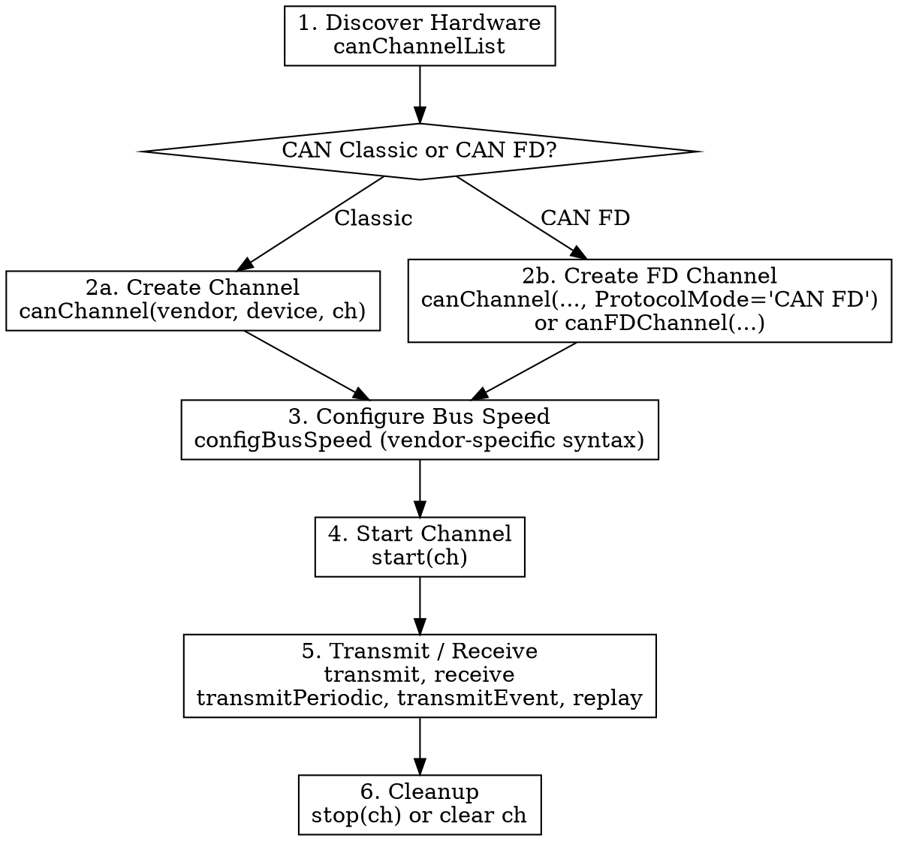

# MATLAB Vehicle Network Communication

## Prerequisites

- MATLAB R2021a or later
- Vehicle Network Toolbox installed (`ver('vnt')` to verify)
- For physical hardware: vendor-specific drivers installed (Vector CANlib, Kvaser CANlib, NI-XNET, PEAK PCAN driver)
- For testing without hardware: MathWorks Virtual channels are always available

## Overview

Guide Claude through helping users establish vehicle network communication using MATLAB Vehicle Network Toolbox. This skill covers the full workflow from hardware discovery to message exchange across all supported protocols and vendors.

**Implemented protocols:**
- CAN / CAN FD — fully documented

**Planned protocols (architecture ready, not yet documented):**
- J1939 — parameter groups, transport protocol, address claiming
- XCP — measurement, calibration, A2L file handling
- Additional protocols as VNT adds support

## When to Use

- User wants to send/receive messages on a vehicle network bus in MATLAB
- User is setting up a communication test bench or loopback verification
- User asks about Vehicle Network Toolbox channel configuration
- User encounters channel errors (initialization access, bus speed, no acknowledgment)
- User wants to filter, decode, or analyze vehicle network messages
- User asks which hardware works on their platform
- User wants passive bus monitoring without affecting traffic
- User needs to encode/decode signal data from messages

## When NOT to Use

- User wants to log/replay BLF files without live communication — use a BLF logging skill
- User is building Simulink vehicle network blocks — use Simulink-specific skills
- User needs CAN database file (DBC/LDF/A2L) creation or editing — this skill covers using existing files only
- User is working with a protocol not yet documented in this skill (check protocol sections below)

## Protocol Router

Use this decision tree to identify which protocol the user needs:

| User's Goal | Protocol | Reference Section |
|-------------|----------|-------------------|
| Send/receive CAN or CAN FD messages | CAN/CAN FD | `references/can/` |
| Work with SAE J1939 parameter groups | J1939 | *Not yet documented* |
| ECU measurement or calibration via XCP/CCP | XCP | *Not yet documented* |
| General hardware discovery (any protocol) | Shared | `references/shared/` |

If the user asks about a protocol not yet documented, inform them which protocols are currently covered and offer to help with those.

## Shared Concepts (All Protocols)

### Hardware Discovery

```matlab
t = canChannelList;  % CAN/CAN FD/J1939 devices
```

All VNT protocols share the same hardware discovery mechanism. See [references/shared/hardware-discovery.md](references/shared/hardware-discovery.md).

### Channel Lifecycle

All protocols follow the same lifecycle pattern:

```
Create Channel → Configure → Start → Operate → Stop/Cleanup
```

Key rules:
- Configuration (bus speed, filters) must happen BEFORE `start`
- `clear ch` releases the channel (equivalent to stop + destroy)
- Use `onCleanup(@() stop(ch))` for error-safe cleanup
- Running channels hold InitializationAccess — blocking new channel creation

See [references/shared/channel-lifecycle.md](references/shared/channel-lifecycle.md).

### Vendor / Platform Matrix

| Vendor | Windows | Linux | Notes |
|--------|:-------:|:-----:|-------|
| Vector | Yes | No | Virtual channels if driver installed |
| NI | Yes | No | No channel index in constructor |
| Kvaser | Yes | Yes | Restart MATLAB after connecting hardware |
| PEAK-System | Yes | Yes | 10-arg clock-based configBusSpeed |
| SocketCAN | No | Yes | Configure speed at OS level via `ip link` |
| MathWorks Virtual | Yes | Yes | Always available, no driver needed |

---

## CAN / CAN FD

### Troubleshooting Gate

**If the user reports a CAN/CAN FD problem** — "not working", "trouble", "error", "can't connect", "no messages", hardware not detected, or any communication failure — you MUST do one of the following:

1. **Domain-knowledge question** ("why does X cause Y", "what's the maximum stub length for CAN FD", "explain bit rate switching") — answer from [references/can/troubleshooting/l1-domain-knowledge.md](references/can/troubleshooting/l1-domain-knowledge.md) without running diagnostics.

2. **Actionable problem requiring diagnosis** — **Load** [references/can/troubleshooting/diagnostic-workflow.md](references/can/troubleshooting/diagnostic-workflow.md) BEFORE responding. **Follow** its Entry-Point Routing to select the correct starting step. **Do NOT diagnose from this file.** The tables, pitfalls, and patterns below are reference material for healthy operation — they are NOT a diagnostic procedure. Improvising from them produces wall-of-text responses with multiple guesses instead of structured one-question-at-a-time triage.

### Core Workflow



### Post-Transmit Verification (MANDATORY)

After ANY transmit, verify the bus accepted the frame before reporting success:

```matlab
pause(0.5);
fprintf('TEC=%d REC=%d BusStatus=%s\n', ch.TransmitErrorCount, ch.ReceiveErrorCount, ch.BusStatus);
```

| Result | Action |
|--------|--------|
| TEC=0, REC=0, ErrorActive | Healthy — report success |
| TEC>0 OR REC>0 OR not ErrorActive | Unhealthy — report counters to user, route to [diagnostic workflow Step 0.5](references/can/troubleshooting/diagnostic-workflow.md). Follow diagnostic Interaction Rules (one question at a time). |

**Never claim "sent successfully" from `transmit` returning without error.** It is non-blocking and returns immediately regardless of bus state. When routing to diagnostics, do NOT list multiple possible causes — let Step 0.5 identify the root cause and ask one targeted question.

### CAN Classic vs CAN FD Decision

| Aspect | CAN Classic | CAN FD |
|--------|-------------|--------|
| Max payload | 8 bytes | 64 bytes |
| Message constructor | `canMessage(id, ext, dlc)` | `canFDMessage(id, ext, dlc)` or `canMessage(..., ProtocolMode="CAN FD")` |
| Channel creation | `canChannel(vendor, device, ch)` | Add `'ProtocolMode', 'CAN FD'` or use `canFDChannel` |
| Bus speed config | Single speed | Arbitration + Data phase (vendor-specific syntax) |
| `receive` output | Objects or timetable | Always timetable |
| Valid DLCs | 0–8 | 0, 8, 12, 16, 20, 24, 32, 48, 64 |

### Critical Patterns (Non-Obvious API Behavior)

These patterns are where the API behaves differently than expected. Follow these exactly.

#### attachDatabase operates on MESSAGES, not channels

```matlab
% WRONG — will error
attachDatabase(ch, db);
ch.Database = db;  % only valid for name-based filterAllowOnly

% CORRECT — attach to received message object
rxMsg = receive(ch, 1);
attachDatabase(rxMsg, db);
speed = rxMsg.Signals.EngineSpeed;
```

#### transmitPeriodic + pack for live signal updates

```matlab
% WRONG — manual loop blocks MATLAB, timing is inaccurate
while running
    pack(msg, newValue, 0, 16, 'LittleEndian');
    transmit(ch, msg);
    pause(0.1);
end

% CORRECT — hardware-timed, non-blocking
transmitPeriodic(ch, msg, 'On', 0.1);
start(ch);
pack(msg, newValue, 0, 16, 'LittleEndian');  % next cycle sends updated data
```

#### filterAllowOnly REQUIRES type argument for numeric IDs

```matlab
% WRONG — errors with "Expected NAME to be one of these types: char, cell"
filterAllowOnly(ch, [0x180 0x181]);

% CORRECT — must specify 'Standard' or 'Extended'
filterAllowOnly(ch, [0x180 0x181], 'Standard');
filterAllowOnly(ch, [0x18FEF100], 'Extended');
```

#### CAN FD configBusSpeed is vendor-specific

```matlab
% MathWorks Virtual / NI — simple 3-arg form works
configBusSpeed(ch, 500000, 2000000);

% Vector / Kvaser — REQUIRES 9-arg advanced timing form
configBusSpeed(ch, 500000, 2, 6, 3, 2000000, 2, 6, 3);

% PEAK-System — REQUIRES 10-arg clock-based form
configBusSpeed(ch, 20, 5, 1, 2, 1, 2, 1, 3, 1);
```

#### CAN FD receive ALWAYS returns timetable

```matlab
% CAN FD channels ignore OutputFormat — always timetable
msgs = receive(fdCh, Inf);       % returns timetable
msgs.ID                          % numeric vector of IDs
msgs.Data{1}                     % uint8 vector for first message
% WRONG: msgs(1).Data, msgs.Data(1) — these error on timetable
```

#### transmitEvent fires on ANY .Data write (including pack)

```matlab
transmitEvent(ch, msg, 'On');
start(ch);
pack(msg, value, 0, 16, 'LittleEndian');  % this auto-transmits!
% No explicit transmit() call needed — pack triggers it
```

### Common Pitfalls

| Pitfall | Symptom | Fix |
|---------|---------|-----|
| Stale channel object | "lacks initialization access" | `clear` the variable or `stop` prior channel |
| `canMessage` for FD payload | "DATALENGTH must be <= 8" | Use `canFDMessage` or add `ProtocolMode="CAN FD"` |
| No acknowledging node | Transmit retries continuously | Ensure another node/channel is started on the bus |
| Claiming success without checking counters | User believes data sent; bus is ErrorPassive | ALWAYS check TEC/REC/BusStatus after transmit |
| Bus speed mismatch | Transmit succeeds, receive empty | All nodes must share same speed |
| `configBusSpeed` after `start` | Error | Must configure while channel is offline |
| Reusing variable | Error on creation | `clear` variable before creating new channel |
| `configBusSpeed` on SocketCAN | Not supported | Configure speed at OS level via `ip link` |
| CAN FD on PEAK-System Linux | Self-receive not supported | Use SocketCAN as workaround |
| `unpack` on timetable | "Incorrect number or types of inputs" | CAN FD always returns timetable; use `typecast(data(1:2), 'int16')` on raw bytes |

### CAN References

Detailed API documentation (load on demand):
- [references/can/channel-creation.md](references/can/channel-creation.md) — `canChannel`, `canFDChannel`, vendor-specific syntax
- [references/can/bus-speed-config.md](references/can/bus-speed-config.md) — `configBusSpeed`, vendor-specific argument counts
- [references/can/message-creation.md](references/can/message-creation.md) — `canMessage`, `canFDMessage`, valid FD DLCs
- [references/can/transmit.md](references/can/transmit.md) — `transmit`, `transmitPeriodic`, `transmitEvent`, `replay`
- [references/can/receive.md](references/can/receive.md) — `receive`, `SilentMode`, timetable output, FIFO behavior
- [references/can/filters.md](references/can/filters.md) — `filterAllowOnly`, `filterBlockAll`, `filterAllowAll`
- [references/can/database.md](references/can/database.md) — `canDatabase`, `attachDatabase`, signal-level decode/encode
- [references/can/pack-unpack.md](references/can/pack-unpack.md) — `pack`, `unpack`, signal extraction, byte-order
- [references/can/message-extraction.md](references/can/message-extraction.md) — `extractAll`, `extractRecent`, `extractTime`, `discard`

### CAN Troubleshooting

See **Troubleshooting Gate** at the top of this section. Also route to diagnostics when the agent observes unhealthy bus state (TEC/REC > 0, BusStatus not ErrorActive) during any operation — including after transmit verification.
- [references/can/troubleshooting/diagnostic-workflow.md](references/can/troubleshooting/diagnostic-workflow.md) — Full diagnostic procedure (Phase 0 automation, L1 physical, L2 traffic analysis)
- [references/can/troubleshooting/script-interfaces.md](references/can/troubleshooting/script-interfaces.md) — Function signatures, arguments, and outputs for all diagnostic/analysis scripts

---

## Shared References

- [references/shared/hardware-discovery.md](references/shared/hardware-discovery.md) — `canChannelList`, platform constraints
- [references/shared/channel-lifecycle.md](references/shared/channel-lifecycle.md) — `start`, `stop`, `onCleanup`, channel release
- [references/shared/limitations.md](references/shared/limitations.md) — Vendor/platform-specific constraints

----

Copyright 2026 The MathWorks, Inc.

----
