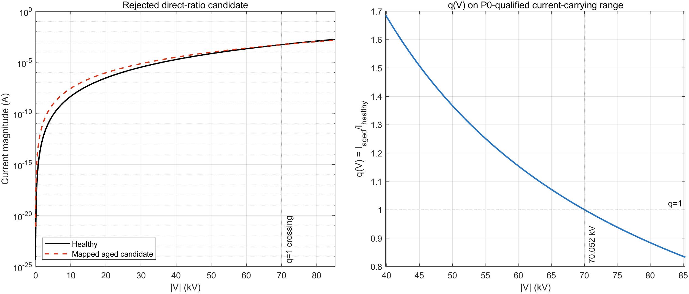

# Phase 2-P1A — Literature Aging Source Freeze and V–I Mapping Qualification

> **NO HISTORICAL MATRIX RERUN.**  
> **Case05-P / Case06-P × M0/M2/M3/M4: ALL NOT RUN.**

## 1. 阶段结论

```text
AGING_PROVENANCE_SOURCE = FROZEN
SOURCE_LEVEL_AGING_DATA = FROZEN
MODEL_ALPHA_A = NOT FROZEN
MODEL_UREF_A = NOT FROZEN

DIRECT_RATIO_MAPPING = REJECTED
P1A_SOURCE_FREEZE = PASS
MODEL_PARAMETER_FREEZE = PENDING_DIGITIZED_VI_CURVES
EXTERNAL_VALIDATION_8_GROUPS_AUTHORIZED = NO
```

本阶段完成的是文献来源冻结和映射否证，不是 aged model 参数标定。Fu 2024 Sample B 的 before/after 数据可以作为后续 curve-based mapping 的 provenance anchor，但三个 source-level 比值不能直接乘到本工程 `alpha0`、`Uref0` 上。直接比例映射在当前工作区高电压段产生 `Iaged<Ihealthy`，与原文所述 aged V–I curve 向高电流方向移动不一致，因此正式拒绝。

## 2. Primary literature source freeze

### 2.1 完整来源

Zhengzheng Fu, Zongxi Zhang, Songhai Fan, Tao Cui, Donghui Luo, Yiping Jiang, Pengfei Meng, Jingke Guo, and Yue Yin, “Effect of MnO₂ doping on AC aging characteristics of varistor in arrester,” *International Journal of Ceramic Engineering & Science*, vol. 6, e10235, 2024. DOI: [10.1002/ces2.10235](https://doi.org/10.1002/ces2.10235).

核对来源：[Wiley Online Library 原文页面](https://ceramics.onlinelibrary.wiley.com/doi/10.1002/ces2.10235)，访问日期 2026-09-28。配方来自 Table 1；before/after 电气参数来自 Table 2；V–I 曲线方向来自 Figure 1 及相邻正文。

### 2.2 冻结样品和 aging 条件

正式选择：**Sample B，1.0 mol% MnO₂**。

除 MnO₂ 含量外，Table 1 中 Sample B 的配方为：93.8 mol% ZnO、0.70 mol% Bi₂O₃、1.00 mol% Co₂O₃、0.50 mol% Cr₂O₃、1.00 mol% Sb₂O₃、1.25 mol% SiO₂、0.75 mol% Y₂O₃；Ni₂O₃ 和 Ag₂O 均为 0。

冻结 aging 条件：

| 条件 | 冻结值 |
|---|---:|
| Aging type | AC accelerated aging |
| Charge rate `S` | `0.85` |
| Temperature | `135 °C` |
| Duration | `168 h` |

### 2.3 Table 2 source-level values

| 参数 | Before | After | 精确比值 `after/before` | 由表中数值重算的变化 |
|---|---:|---:|---:|---:|
| `E1mA` | `305.82 V/mm` | `300.38 V/mm` | `rho_E = 0.982211758550781` | `-1.778824%` |
| `alpha` | `63.54` | `53.71` | `rho_alpha = 0.845294302801385` | `-15.470570%` |
| `IL` | `1.50 µA` | `1.70 µA` | `rho_IL = 1.13333333333333` | `+13.333333%` |

Table 2 以两位小数另列约 `-1.78%`、`-15.48%`、`+13.30%`；本工程冻结原始 before/after 数值，并使用它们的精确商，避免再次对已取整百分比运算。

### 2.4 为什么选择 Sample B

Sample B 是人工预先指定且与本阶段目标一致的 degradation case：

- 论文将 1.0 mol% 样品描述为 aging 前综合电气性能最佳的样品；
- aging 后 `E1mA` 下降、`alpha` 明显下降、`IL` 上升，三个指标给出一致的劣化方向；
- Figure 1 相邻正文报告四种配方 aging 后曲线均向电流增大方向移动，并指出 Sample B 的变化明显；
- 其变化既不是接近零的 shape perturbation，也不是本文献中最极端的 2.0 mol% 状态，适合用于后续受约束的外部映射资格审查。

其他样品不作为本阶段 primary mapping source：

| 样品 | MnO₂ | 不选择为本阶段 primary source 的原因 |
|---|---:|---|
| A | 0.5 mol% | `alpha` 仅由 32.11 变为 32.03，Table 2 的 shape-change 指标接近不变，不适合当前“非纯比例”资格问题。 |
| C | 1.5 mol% | `IL` 由 2.25 降至 0.74 µA，aging rate 为负，论文将其解释为 aging 后性能改善；这不是当前拟验证的劣化方向。 |
| D | 2.0 mol% | `alpha` 由 59.27 降至 35.91，属于最强烈的非线性系数变化；论文的微结构讨论还指出 2.0 mol% 已达到/超过 Mn 在晶粒中的饱和相关区间。它保留为独立材料状态，不与 B 混用。 |

以上选择只确定 provenance，不代表 Sample B 的 source-level 数值已可直接移植到 63.5 kV 级模型。

## 3. Source-level data 与 model-level parameters 严格分离

Source-level data 描述的是 Fu 2024 特定阀片配方、尺寸、测试定义和电流/电场区间中的 `E1mA`、文献 `alpha` 与 `IL`。当前 model-level healthy parameters 描述的是 AutoComp9 在运行电压区的工程化局部幂律：

```text
alpha0 = 6
Uref0 = 63.5085296 kV
Iref  = 0.3 mA
```

二者的绝对指数、参考点、尺度和拟合区间不同。`E1mA` 是 1 mA 条件下的电场强度，而 `Uref0` 是本工程中令瞬时幂律电流等于 `Iref=0.3 mA` 的整机电压参考。文献 `alpha=63.54` 也不是当前模型 `alpha0=6` 的同尺度参数。因此，本阶段只冻结来源与方向，不冻结：

```text
alpha_a = NOT FROZEN
Uref_a  = NOT FROZEN
```

## 4. Direct-ratio mapping rejection

### 4.1 只用于否证的候选参数

按照已被预审拒绝、但需定量核验的映射：

\[
\alpha_{a,c}=\rho_\alpha\alpha_0,
\qquad
U_{\mathrm{ref},a,c}=\rho_E U_{\mathrm{ref},0},
\]

得到：

| 量 | Rejected candidate |
|---|---:|
| `alpha_a_candidate` | `5.07176581680831` |
| `Uref_a_candidate` | `62.3788245413904 kV` |

这些数值只存在于 rejection audit 中，**不得作为正式 aged model 参数引用**。

### 4.2 `q(V)` 推导

在相同 `Iref` 下：

\[
I_0(V)=I_{\mathrm{ref}}\left(\frac{V}{U_0}\right)^{\alpha_0},
\qquad
I_{a,c}(V)=I_{\mathrm{ref}}\left(\frac{V}{\rho_E U_0}\right)^{\rho_\alpha\alpha_0}.
\]

因此：

\[
q(V)=\frac{I_{a,c}(V)}{I_0(V)}
=\rho_E^{-\rho_\alpha\alpha_0}
\left(\frac{V}{U_0}\right)^{\alpha_0(\rho_\alpha-1)}.
\]

由于 `rho_alpha<1`，指数 `alpha0(rho_alpha-1)<0`，所以 `q(V)` 随电压单调下降。交点为：

\[
V_*=U_0\rho_E^{\frac{\rho_\alpha\alpha_0}
{\rho_\alpha\alpha_0-\alpha_0}}
=70.0522912819994\ \mathrm{kV}.
\]

### 4.3 当前工作区结果

P0 保存的一周期健康波形给出实际峰值 `85.3238929966314 kV`。在 `V=0` 时两条曲线均为零，`q=0/0` 未定义；又因候选指数小于健康指数，`V→0+` 时 `q→∞`。因此在完整实际幅值域 `(0,Vpeak]` 上，`q_min=0.832718673876393`（位于峰值），而 `q_max` 不存在有限值（上确界为 `+∞`）。零交越附近两条电流均趋近于零，不能把该处的倍率当作稳定指标。

采用 P0 已冻结的零值排除规则（`|u|≥1%` 峰值且 `|ir|≥1%` 峰值），有效 current-carrying 电压区间为 `39.8949298461140–85.3238929966314 kV`：

| 指标 | 结果 |
|---|---:|
| `q_min`（P0-qualified range） | `0.832718673876393` |
| `q_max`（P0-qualified range） | `1.68638823602214` |
| `q=1` 交点 | `70.0522912819994 kV` |
| 电压峰值处 `q` | `0.832718673876393` |
| `Iaged<Ihealthy` 区间 | `70.0522912819994 < |V| ≤ 85.3238929966314 kV` |



结果表明，该候选在低于交点时给出 `Iaged>Ihealthy`，但越过交点后反转，在当前峰值处反而降低约 `16.73%`。Fu 2024 对 Figure 1 的方向性描述是 aging 后曲线向更高电流方向移动；直接比例映射不能在本工程实际高电压工作区保持这一方向，故：

```text
DIRECT_RATIO_MAPPING = REJECTED
```

该否证不等同于否定 Fu 2024 的实验数据；它否定的是把两个跨尺度比值直接乘到本工程局部幂律参数上的映射规则。

## 5. Curve-based mapping interface

已创建两个仅含表头的空模板：

- `literature_vi_before.csv`
- `literature_vi_after.csv`

字段固定为：

```text
x_value,current,x_definition,source_figure,digitization_uncertainty
```

`x_value` 必须保存原图横轴读数；`x_definition` 必须明确该读数是 field 还是 voltage，并保留原文单位、定义及坐标形式。禁止先做换算，再用换算结果覆盖原始数字化值。`source_figure` 用于锁定原图与 before/after 曲线身份，`digitization_uncertainty` 保存数字化不确定度。

当前两个模板都只有表头，没有任何伪造或插值数据行。后续只有取得可靠的 Fu 2024 Figure 1 Sample B before/after 数字化点后，才能按以下链路继续：

```text
literature before/after V-I curves
→ axis/unit and provenance verification
→ normalized V-I curves
→ matched local-window fit or shape transform
→ uncertainty propagation
→ candidate aged model
→ A–E qualification before any algorithm run
```

填充模板前必须冻结：曲线/样品标识、坐标轴单位与 log/linear 形式、数字化工具、点选择规则、拟合区间、每点不确定度、原图来源及文件 hash。`E1mA`、`alpha` 和 `IL` 三个表格值只能作为曲线映射的约束/交叉检查，不能替代 before/after 曲线。

已创建 `analysis/run_phase2p1_vi_mapping.m` 作为后续 mapping 的安全入口。脚本只读取上述两个 CSV，校验字段和配对状态，并预留以下输出接口：

1. before/after normalized V–I curves；
2. `q(V)=Iaged/Ihealthy` 及 median/P5/P95/spread；
3. optimal constant scaling residual `epsilon_shape`；
4. healthy/aged local power-law fitting；
5. I1/I3/I5 非同比例预测；
6. `deltaI(V)=Iaged(V)-Ihealthy(V)` 及 VI direction consistency。

当前模板为空，因此脚本不执行任何拟合或外推，不生成 `alpha_a`、`Uref_a`，并输出：

```text
MAPPING_STATUS = WAITING_FOR_DIGITIZED_CURVES
MODEL_ALPHA_A_GENERATED = NO
MODEL_UREF_A_GENERATED = NO
```

## 6. Independent consistency reference

Khodsuz & Mirzaie 2015 被单独保存为：

```text
REFERENCE_ROLE = EXTERNAL_FIELD_AGED_CONSISTENCY_REFERENCE
```

该研究使用从运行 15 年避雷器中取出的 aged varistor；其 virgin/aged V–I characteristic 明显变化。Table 8 中三个 aged-varistor 安装位置均表现为 `ir1`、`ir3` 增大而 `ir5` 降低。其边界结论是：长期运行退化阀片在避雷器实验重构条件下可引起阻性电流谐波的非同比例变化，因此物理老化验证不应仅检查总幅值或采用常数倍率模型。完整记录见 `EXTERNAL_FIELD_AGED_CONSISTENCY_REFERENCE.md`。

该证据只用于方向一致性检查，**不得与 Fu 2024 Sample B 参数拼接**，也不得据此反推 `alpha_a` 或 `Uref_a`。

## 7. 执行边界与产物

本阶段 MATLAB 分析只读取 P0 已保存的 `health_waveform_one_cycle.csv` 和两个空的 literature V–I CSV 模板，未加载 Simulink 模型。执行记录明确为：

```text
SIMULINK_MODEL_LOADED = NO
M0_M2_M3_M4_RUN = NO
CASE05P_CASE06P_RUN = NO
HISTORICAL_MATRIX_RERUN = NO
MAPPING_STATUS = WAITING_FOR_DIGITIZED_CURVES
```

新增非侵入式产物：

- `analysis/run_phase2p1a_direct_ratio_rejection.m`
- `analysis/run_phase2p1_vi_mapping.m`
- `analysis_outputs/direct_ratio_mapping_rejected_summary.csv`
- `analysis_outputs/direct_ratio_mapping_rejected_curve.csv`
- `analysis_outputs/direct_ratio_mapping_rejected_audit.txt`
- `analysis_outputs/direct_ratio_mapping_rejected.png/.fig/.mat`
- `analysis_outputs/vi_mapping_status.txt`
- `literature_vi_before.csv`
- `literature_vi_after.csv`
- `EXTERNAL_FIELD_AGED_CONSISTENCY_REFERENCE.md`

冻结模型 `AI6109_MOA_AutoComp9.slx` 的 SHA-256 复核仍为：

```text
56067ADAADF59B5921D7156A2ABB61777C4E98B69CB4150759C3CB1D4D6A2A70
```

## 8. 8 组 external validation 状态

| Case | M0 | M2 | M3 | M4 |
|---|---|---|---|---|
| Case05-P：真实 Cs 不变 + V–I aging | NOT RUN | NOT RUN | NOT RUN | NOT RUN |
| Case06-P：真实 Cs 漂移完成 + V–I aging | NOT RUN | NOT RUN | NOT RUN | NOT RUN |

M0 保留。只有 curve-based mapping 完成、候选 aged model 通过非恒定 `q(V)`、波形形状变化、I1/I3/I5 非同比例变化及参数 provenance 检查，并由人工冻结具体参数后，才可另行决定是否授权 8 组实验。

## 9. Release audit

```text
FUNCTIONAL-COMPLETENESS RETROSPECTIVE
Scope covered: Fu 2024 provenance, direct-ratio rejection, curve interface, independent field-aged consistency evidence, and eight-run authorization gate.
Authority and locks: passed for source freeze; frozen baselines, models, algorithms, and historical results were not modified.
Alignment: source-level values are separated from model-level parameters; rejected candidates are visibly labeled.
Adapters and overlays: computational/simulation evidence boundaries and claim–citation alignment checked.
Change propagation: report, CSV templates, mapping skeleton, audit CSV/TXT/MAT, and figure checked against the same active status vocabulary.
Deterministic and visual checks: MATLAB Code Analyzer and empty-template execution checked; the pre-existing direct-ratio figure was not regenerated.
Open issues and unknowns: Fu 2024 Sample B before/after curve points and digitization uncertainty remain unavailable; model parameter freeze therefore remains pending.
Readiness: ready for Phase 2-P1A source freeze only; not ready for external validation runs.
```

## 10. 最终状态

```text
P1A_SOURCE_FREEZE = PASS
MODEL_PARAMETER_FREEZE = PENDING_DIGITIZED_VI_CURVES
EXTERNAL_VALIDATION_8_GROUPS_AUTHORIZED = NO

NO HISTORICAL MATRIX RERUN.
```
