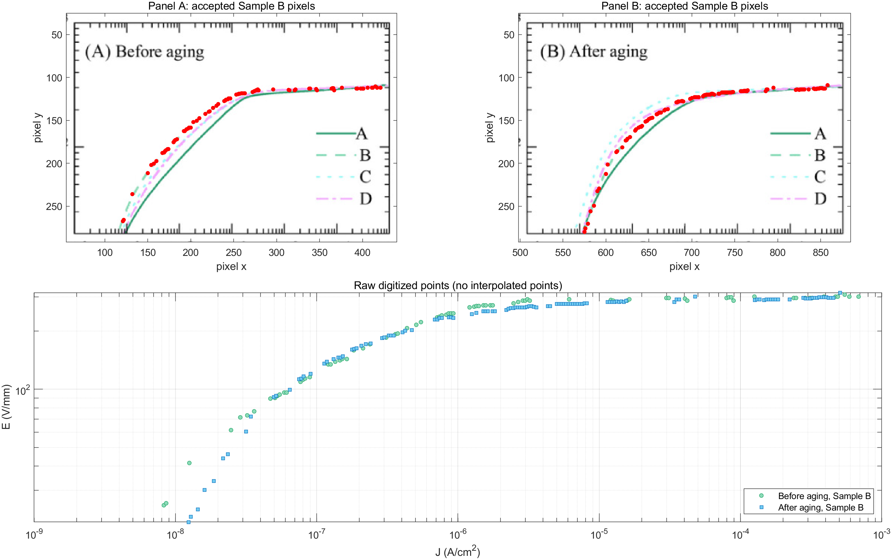

# Phase 2-P1B FINAL — Fu 2024 Sample B E–J Curve Digitization, Literature Aging Shape Mapping and Aged Model Freeze

> **FIGURE_IDENTITY_CHECK = PASS**  
> **MAPPING_STATUS = FAIL_INSUFFICIENT_COVERAGE**  
> **NO HISTORICAL MATRIX RERUN.**

## 1. 最终结论

Fu 2024 Figure 1 的 Sample B before/after 曲线可以可靠识别和数字化，但两条曲线的共同有效场强范围不能覆盖 AutoComp9 已冻结的完整 `xi_model=0.514–1.099` 区间。名义共同上限仅为 `xi=1.009525862`；即使将端点数字化不确定度全部向扩大覆盖的方向计入，共同上限也只有 `xi=1.039185784`，仍低于 `1.099`。

依照预先冻结的 coverage gate，本轮在构造 `q_lit` 之前停止：

```text
P1B_CURVE_MAPPING = FAIL
PHYSICAL_AGING_MODEL_QUALIFICATION = PENDING_ADEQUATE_LITERATURE_COVERAGE
AGING_SHAPE_MAPPING = NOT FROZEN
AGED_MODEL_FROZEN = NO
EXTERNAL_VALIDATION_8_GROUPS_AUTHORIZED = NO

NO HISTORICAL MATRIX RERUN.
```

该负结果不否定 Fu et al. (2024) 的实验曲线，也不否定相对 E–J shape mapping 的方法；它只说明当前 Figure 1 无法在不外推的条件下覆盖本工程冻结的高场端工作区。

## 2. 冻结来源图

正式文献：Zhengzheng Fu, Zongxi Zhang, Songhai Fan, Tao Cui, Donghui Luo, Yiping Jiang, Pengfei Meng, Jingke Guo, and Yue Yin, “Effect of MnO₂ doping on AC aging characteristics of varistor in arrester,” *International Journal of Ceramic Engineering & Science*, vol. 6, e10235, 2024. DOI: [10.1002/ces2.10235](https://doi.org/10.1002/ces2.10235).

用户提供的正式截图已按原始字节保存为：

```text
source/Fu2024_Figure1.png
SHA-256 = 319E21A82E73D47B82DEE27B68A8C8C964A45B5A5BF6E592D34EAF291193DD3D
pixel size = 909 × 484
pixel format = 32-bit ARGB PNG
```

阶段目录根部的用户输入与 `source/` 冻结副本哈希一致。原图未修改；数字化审核图另存于 `derived/`。

## 3. Figure identity qualification

视觉检查确认：

| 项目 | 结论 |
|---|---|
| Panel A | Before aging |
| Panel B | After aging |
| 横轴 | `J (A/cm²)`，log10 scale |
| 纵轴 | `E (V/mm)`，log10 scale |
| Sample A | 深绿色实线 |
| Sample B | 浅绿色虚线 |
| Sample C | 青色点线/短虚线 |
| Sample D | 紫色点划线 |
| 正式数字化对象 | Sample B only |

Sample B 与 A/C/D 的颜色及线型可以区分。高场平台区多条曲线局部接近，因此数字化不确定度包含额外的曲线身份项；没有通过修改像素或补点强迫曲线分离。

```text
FIGURE_IDENTITY_CHECK = PASS
```

## 4. 像素—数据坐标标定

两 panel 分别建立

\[
p_x=a_x\log_{10}(J)+b_x,
\qquad
p_y=a_y\log_{10}(E)+b_y.
\]

完整主刻度与误差记录见 `figure_axis_calibration.csv`。冻结结果为：

| Panel | Axis | pixels/decade | intercept | RMSE (px) | max residual (px) | tick uncertainty (px) |
|---|---|---:|---:|---:|---:|---:|
| A | J | 61.000000 | 614.000000 | `<1e-12` | `<1e-12` | 0.75 |
| B | J | 61.357143 | 1060.142857 | 0.247436 | 0.357143 | 0.75 |
| A | E | -144.000000 | 469.000000 | `<1e-12` | `<1e-12` | 0.75 |
| B | E | -144.000000 | 469.000000 | `<1e-12` | `<1e-12` | 0.75 |

J 轴使用 `10⁻⁹–10⁻³ A/cm²` 的 decade 主刻度；E 轴使用 `10²`、`10³ V/mm` 主刻度。由 E 轴标定反算图框下限约为 `20 V/mm`，与图中 minor ticks 一致。所有映射均在 log10 坐标执行，没有采用线性坐标近似。

## 5. Sample B 原始数字化

数字化规则在运行任何算法前冻结：

1. 从图例读取 A/B/C/D 颜色原型；
2. 用“颜色原型—白色”抗锯齿混合线距离对彩色像素分类；
3. 只保留 Sample B 类别、panel 数据区内且不属于图例框的像素；
4. 每个实际命中的 x 像素列取线宽中心；
5. 使用 E–J 单调性剔除超过 2.5 px 容差的反向跳点，以防虚线空档中的 A/C/D 抗锯齿像素误入；
6. 不对原始 CSV 插值、不平滑、不人工补点。

输出：

| 文件 | 原始数据行 |
|---|---:|
| `literature_vi_before.csv` | 78 |
| `literature_vi_after.csv` | 119 |

字段为：

```text
E_V_per_mm
J_A_per_cm2
source_panel
sample
aging_state
pixel_x
pixel_y
digitization_uncertainty_E
digitization_uncertainty_J
```

所有数据行均标记 `sample=B`；before 来自 panel A，after 来自 panel B。



## 6. 数字化不确定度

每个原始点的不确定度至少合并：

- 主刻度读取误差：`0.75 px`；
- 坐标回归残差；
- 曲线半线宽：`1.5 px`；
- B 与 A/C/D 的局部颜色身份裕量：`0.75–2.0 px`。

这些像素误差先在 log10 坐标内传播，再转换为每点的 `digitization_uncertainty_E` 和 `digitization_uncertainty_J`。由于 coverage gate 已失败，本轮没有进入 log interpolation，因而没有虚构“插值误差”或 `uncertainty_q`。

## 7. Table 2 anchors 的使用边界

P1A 冻结的 Sample B source-level anchors 保持不变：

| 状态 | `E1mA` | `alpha` | `IL` |
|---|---:|---:|---:|
| Before | 305.82 V/mm | 63.54 | 1.50 µA |
| After | 300.38 V/mm | 53.71 | 1.70 µA |

Figure 1 横轴是电流密度 `J`，Table 2 的 `E1mA` 是总电流达到 1 mA 时的场强。正文未提供足以把 `J` 唯一换算为总电流的有效面积，因此本轮没有把 `J=10⁻³ A/cm²` 冒充为 1 mA，也没有伪造面积做绝对 anchor 拟合。

`E1mA_before=305.82 V/mm` 仅用于共同无量纲场强坐标：

\[
\xi_{lit}=E/(305.82\ \mathrm{V/mm}).
\]

before 和 after 均使用同一个 before reference；没有用 `300.38 V/mm` 对 after 单独归一化。文献 `alpha` 的完整拟合窗口未由 Figure 1/正文充分定义，因此没有声称从数字化图复现 `63.54` 或 `53.71`。

## 8. Coverage qualification

AutoComp9 冻结参数：

```text
alpha0 = 6
Uref0 = 63.5085296 kV
Iref = 0.3 mA
U1mA_model = 77.620871631 kV
required xi_model = 0.514–1.099
```

要求区间在 Fu 的共同坐标上对应：

```text
E_required = 157.19148–336.09618 V/mm
```

数字化覆盖结果：

| 范围 | xi min | xi max |
|---|---:|---:|
| Before nominal | 0.082004875 | 1.009525862 |
| After nominal | 0.067148160 | 1.034032326 |
| Common nominal | 0.082004875 | 1.009525862 |
| Common with favorable endpoint uncertainty | 0.079261641 | 1.039185784 |
| Required | 0.514000000 | 1.099000000 |

低场端覆盖充分；高场端不足。共同名义最大场强约为 `308.7332 V/mm`。即使加入有利端点不确定度，最大场强也仅约 `317.8038 V/mm`，距离要求的 `336.0962 V/mm` 仍缺 `18.2924 V/mm`，即 `Δxi=0.059814216`。

这不是端点像素误差内的极小边界处理。若继续构造完整工作区 `q_lit`，必须在文献曲线之外进行明显高场外推，违反预先冻结规则。因此：

```text
COVERAGE_PASS = NO
MAPPING_STATUS = FAIL_INSUFFICIENT_COVERAGE
```

## 9. STOP 后未执行的分析

coverage gate 失败后立即停止。以下内容没有生成或计算：

- `literature_vi_ratio.csv`；
- `q_median`、`q_P5`、`q_P95`、`Dq`；
- `q_lit` 的非恒定性检验；
- `candidate_aged_waveform.csv`；
- `aging_shape_mapping.mat`；
- `c*` 与 `epsilon_shape`；
- `g1/g3/g5`；
- E–J direction consistency 的定量映射检查；
- `Fu2024_SampleB_q_xi.png`；
- `candidate_aged_current_one_cycle.png`；
- `candidate_aged_harmonics.png`。

未生成这些产物是 coverage STOP 的执行结果，不是遗漏。特别是，不允许通过高场常数延拓、幂律外推或截断 AutoComp9 工作区来制造 PASS。

## 10. A–F qualification 状态

| 判据 | 状态 | 原因 |
|---|---|---|
| A. 非恒定倍率 | NOT EVALUATED | coverage gate 先失败，`q_lit` 未建立 |
| B. 波形形状变化 | NOT EVALUATED | candidate aged current 未建立 |
| C. 谐波非同比例 | NOT EVALUATED | I1/I3/I5 未计算 |
| D. provenance | PASS | 原始曲线仅来自 Fu 2024 Sample B |
| E. 禁止反向调参 | PASS | M0/M2/M3/M4 未运行，未查看算法结果 |
| F. E–J direction consistency | NOT EVALUATED QUANTITATIVELY | coverage STOP 发生在 `q_lit` 构造前 |

A–F 未全部通过，因此不能冻结 aged model。

## 11. 历史保护与执行审计

本轮只运行了 source hash、像素标定、原始数字化和 coverage gate。没有加载 Simulink，没有执行任何历史或 external-validation case。

```text
AI6109_MOA_AutoComp9.slx = UNMODIFIED
M0_M2_M3_M4_RUN = NO
CASE05P_CASE06P_RUN = NO
HISTORICAL_MATRIX_RERUN = NO
```

冻结模型 SHA-256 复核为：

```text
56067ADAADF59B5921D7156A2ABB61777C4E98B69CB4150759C3CB1D4D6A2A70
```

## 12. 负结果的最小解除条件

P1B 只能由具有同一 provenance、且在 `xi=1.039–1.099` 高场缺口提供实测 E–J 信息的可靠来源解除，例如 Fu 2024 Sample B 的原始数据或范围更完整的作者级曲线。不能用 Khodsuz 2015、其他 Sample、表格参数比例或算法表现补齐该缺口。

## 13. 最终状态

```text
FIGURE_IDENTITY_CHECK = PASS
MAPPING_STATUS = FAIL_INSUFFICIENT_COVERAGE

P1B_CURVE_MAPPING = FAIL
PHYSICAL_AGING_MODEL_QUALIFICATION = PENDING_ADEQUATE_LITERATURE_COVERAGE
AGING_SHAPE_MAPPING = NOT FROZEN
AGED_MODEL_FROZEN = NO
EXTERNAL_VALIDATION_8_GROUPS_AUTHORIZED = NO

Case05-P / Case06-P × M0/M2/M3/M4 = ALL NOT RUN
NO HISTORICAL MATRIX RERUN.
```
