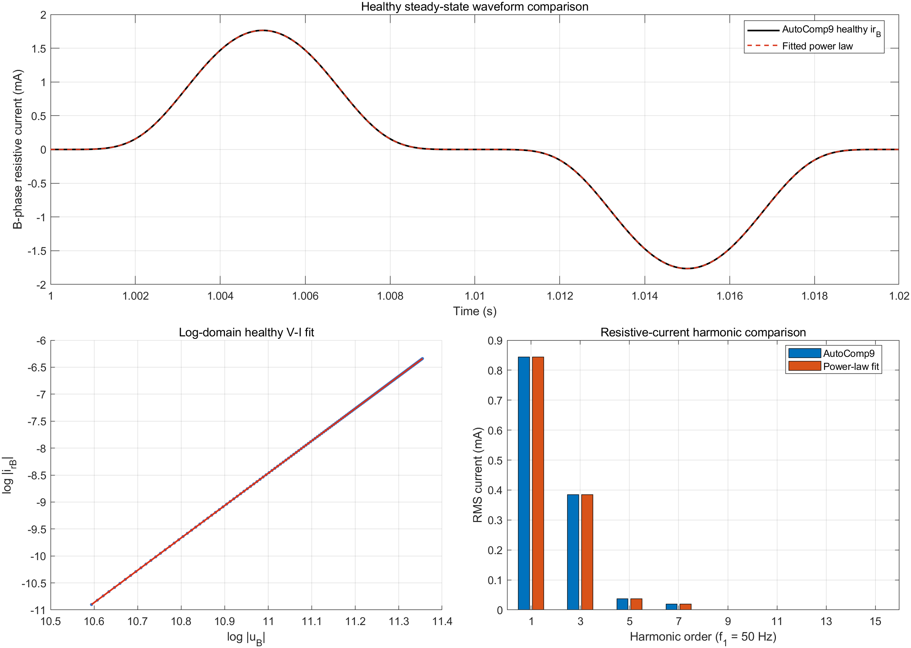

# Phase 2-P0 — Physical Aging Model Qualification

> **NO HISTORICAL MATRIX RERUN.**  
> **Case05-P / Case06-P formal runs executed: NO.**

## 1. Qualification decision

```text
HEALTHY_POWER_LAW_FIT = PASS
AGED_PARAMETER_PROVENANCE = NOT AVAILABLE
AGED_SHAPE_CHANGE_TEST = NOT EXECUTED
MODEL_QUALIFICATION = PENDING_LITERATURE_PARAMETERS
EXTERNAL_VALIDATION_8_GROUPS_AUTHORIZED = NO
```

AutoComp9 的健康 B 相阻性电流并非查表、预设电流波形或谐波电流叠加，而是由模型内三相 MATLAB Function 按同一个参数化 ZnO 幂律逐点生成。健康诊断拟合从输出波形恢复了 `alpha0=6.00000000000617` 和 `K0=4.57223883311607×10^-33 A/V^alpha`；时域 `R²=1`，RMS 归一化 NRMSE 为 `2.46887×10^-9%`。I1、I3、I5 也在数值精度内复现。

该结果证明单一 power law 足以描述**当前仿真 baseline 的健康工作区**，但不构成独立的真实 ZnO 材料验证：被拟合数据本来就由同一形式的幂律生成。当前没有具有文献或实测依据的 `alpha_a`、`Uref,a`，也尚未证明 aged/healthy 波形存在非比例形状变化。因此，模型资格保持 `PENDING_LITERATURE_PARAMETERS`，不得运行冻结的 8 组 external validation。

## 2. 审计边界与执行记录

本阶段只进行了两类非侵入式工作：

1. 只读检查冻结模型 `MATLAB一键实验/AI6109_MOA_AutoComp9.slx`、可复现构建脚本和配置文件；
2. 使用 `Simulink.SimulationInput` 做一次 1.20 s、健康、`B_fault_scale=1`、零测量噪声、固定 `Cs1=Cs2=10 pF` 的诊断运行，并只分析 `[0.80,1.20) s` 稳态窗口。

未调用 `run_phase1a_baseline`、`run_phase2_deterministic_core`、`run_phase2_overlap_matrix`、`run_phase2_monte_carlo` 或任何 Case05-P/Case06-P runner。AutoComp9 的 SHA-256 为：

```text
56067ADAADF59B5921D7156A2ABB61777C4E98B69CB4150759C3CB1D4D6A2A70
```

该值与 Phase1A 冻结 metadata 一致。模型以只读方式关闭，未调用 `save_system`；冻结模型、算法、结果、注册表和历史报告均未修改。

诊断运行保留了 AutoComp9 既有的 Simulink warnings：三个 Current Measurement 辅助端口未连接，以及物理网络—MATLAB Function 路径存在一个 algebraic loop。运行正常完成，稳态输出均为有限值；本轮没有通过修改模型消除这些历史 warning，也不把健康拟合通过解释为这些结构 warning 已被解决。

## 3. 当前健康阻性电流的真实生成机制

### 3.1 `uB(t)` 来源

`uB` 来自 AutoComp9 内的 `Three-Phase Programmable Voltage Source`，经 `Voltage Measurement1` 输出到 workspace。冻结 mask/config 为：

- 正序：`[Un_LL 120 f]`；
- `Un_LL=110 kV` 线电压 RMS，`f=50 Hz`；
- 相电压基准 `Uph=Un_LL/sqrt(3)=63.5085296 kV RMS`；
- harmonic generation 开启；
- 三次电压谐波：`[3 h3_ratio phi3_deg 0]`，其中 `h3_ratio=0.05`、`phi3_deg=0°`；
- 基波负序注入接口：`[1 Vneg_pu 0 2]`，健康 nominal 中 `Vneg_pu=0`；
- 幅值变化功能关闭，电压源在本诊断窗口为稳态。

FFT 验证得到：

| 电压分量 | RMS | 相对 U1 |
|---|---:|---:|
| U1，50 Hz | 63.5085297 kV | 100% |
| U3，150 Hz | 3.17542644 kV | 4.99999993% |
| U5，250 Hz | 3.75 µV | 数值底噪级 |

稳态总 `uB` RMS 为 `63.5878658 kV`，峰值为 `85.3238930 kV`；分别为 `1.001249 pu` 和 `1.343503 pu`，标幺基准为相电压 RMS `Uph`。因此健康电压输入本质上是 50 Hz 基波加 5% 三次谐波，不含有意义的五次及更高电压谐波。

### 3.2 `irB(t)` 来源

AutoComp9 内三个逐相 MATLAB Function 均实现：

```matlab
i = Iref_moa * sign(v) * (abs(v)/Vref_moa)^alpha_moa;
```

统一配置为：

```text
Vref_moa = 63.5085296 kV
Iref_moa = 0.3 mA
alpha_moa = 6
```

B 相物理支路电流由 `Current Measurement4` 保存为 `iB_R_raw`。`DynamicLeakageCurrentModel` 再进行方向统一和故障缩放：

```matlab
iB_R_true = -B_fault_scale * iB_R_raw;
```

健康诊断中 `B_fault_scale=1`，并得到：

```text
max(abs(iB_R_true + iB_R_raw)) = 0 A
```

因此当前 `irB` 的类型是：**三相物理网络中由端电压驱动的无记忆非线性幂律电流，经测量方向统一后输出**。它不是直接给定波形，不是独立谐波合成，不是 V–I 查表，也不含温度、老化状态、滞回、频率依赖或分段曲线。

### 3.3 Case05 的 `1.6×ir` 实现位置

Case05 的 scaling 分两步实现：

1. `generate_coupling_signals.m` 使用

   ```matlab
   faultScale = 1 + 0.6*smooth_step(t,3.0,3.06);
   ```

   生成从 1.0 到 1.6 的平滑过渡；
2. `simulate_phase2_case.m` 将该轨迹作为根级第 3 个 external input `B_fault_scale` 输入 AutoComp9，`DynamicLeakageCurrentModel` 执行

   ```matlab
   iB_R_true = -B_fault_scale*iB_R_raw;
   ```

所以历史 Case05 不改变 `Vref_moa`、`Iref_moa` 或 `alpha_moa`，而是在健康幂律电流产生后施加一个时变但稳态为常数 1.6 的乘法因子。这与其新的论文定位一致：`controlled resistive-current anomaly / mechanism-isolation fault`。

## 4. 健康局部 V–I 幂律拟合

### 4.1 数据和零值排除

拟合只使用 `[0.80,1.20) s` 的健康稳态数据，共 20,000 个均匀采样点，采样频率 `50 kHz`，正好覆盖 20 个 50 Hz 周期。拟合前采用固定、与结果无关的零值排除规则：

```text
|uB| >= 1% × max(|uB|)
|irB| >= 1% × max(|irB|)
sign(uB) = sign(irB)
```

保留 14,840 点，占稳态窗口的 74.2%。随后在 log 域执行普通最小二乘：

```text
log |irB| = log K0 + alpha0 log |uB|
```

参数完全由健康输出波形拟合，没有把 cfg 中的 `alpha=6` 或 `K=Iref/Uref^alpha` 作为拟合约束。时域评价则使用整个稳态窗口，包括零交越附近样本。

### 4.2 拟合结果

| 指标 | 结果 |
|---|---:|
| `K0` | `4.57223883311607×10^-33 A/V^alpha` |
| `alpha0` | `6.00000000000617` |
| 由 `Iref=0.3 mA` 反算的 `Uref0` | `63,508.5296108766 V` |
| R² | `1.000000000000`（保存精度） |
| RMSE | `2.29316253525202×10^-14 A` |
| NRMSE | `2.46887018707114×10^-9%`，定义为 `RMSE/rms(irB)×100%` |
| 最大绝对误差 | `1.00545006348485×10^-13 A` |
| 最大误差/电流峰值 | `5.69911766111195×10^-9%` |
| 电压—电流符号一致率 | `100%` |

配置等效值为：

```text
Kcfg = Iref_moa / Vref_moa^alpha_moa
     = 4.57223883343560×10^-33 A/V^6
```

拟合值相对 `Kcfg` 的误差为 `-6.99×10^-9%`。该差异属于数值拟合与输出采样精度，而不是可观察的模型失配。



## 5. 健康电流的工作范围与谐波

### 5.1 实际与标幺范围

| 量 | 实际值 | 标幺值与基准 |
|---|---:|---:|
| `uB` 总 RMS | 63.5878658 kV | 1.001249 pu，基准 `Uph=63.5085296 kV RMS` |
| `uB` 峰值 | 85.3238930 kV | 1.343503 pu，仍以 RMS `Uph` 为基准 |
| `irB` 总 RMS | 0.928830745 mA | 3.096102 pu，基准 `Iref=0.3 mA` |
| `irB` 峰值 | 1.764220575 mA | 5.880735 pu，基准 `Iref=0.3 mA` |

`Iref` 是瞬时电压等于 `Uref` 时的幂律参考电流，并非输出波形的 RMS 基准，因此 `irB_rms/Iref>1` 并不表示参数矛盾。

### 5.2 FFT 比较

FFT 使用半开稳态窗口 `[0.80,1.20) s`，频率分辨率为 2.5 Hz。关键结果为：

| 分量 | 原始 `irB` RMS | 拟合 `ir_fit` RMS | 相对复现误差 | 相对 I1 |
|---|---:|---:|---:|---:|
| I1，50 Hz | 0.844344568 mA | 0.844344568 mA | `9.59×10^-12%` | 100% |
| I3，150 Hz | 0.384745166 mA | 0.384745166 mA | `2.06×10^-11%` | 45.5673% |
| I5，250 Hz | 0.037487814 mA | 0.037487814 mA | `1.19×10^-10%` | 4.43987% |
| I7，350 Hz | 0.019341339 mA | 0.019341339 mA | `4.40×10^-10%` | 2.29069% |
| I9，450 Hz | 0.000271370 mA | 0.000271370 mA | `3.13×10^-8%` | 0.03214% |
| I11，550 Hz | 0.000658753 mA | 0.000658753 mA | `2.42×10^-8%` | 0.07802% |

I1/I3/I5 的最大相对复现误差为 `1.18705×10^-10%`。至 25 次的 current THD 约为 `45.8405%`，主要由 I3、I5 和 I7 贡献。电压端只有 U1 和 5% U3；I5、I7 及更高奇次电流主要由 `alpha=6` 的非线性映射产生，而不是由相应电压谐波直接注入。

### 5.3 单一 power law 是否足够

对**当前 AutoComp9 健康仿真工作区**，单一 power law 足够，且不是近似意义上的“较好拟合”，而是在数值精度内复现原生成方程。健康拟合阶段不触发 STOP 条件。

该结论不能外推为：

- 单一 power law 足以描述真实 ZnO 阀片的完整 V–I 曲线；
- 同一 `alpha` 可跨低电流、高电流、温度和老化状态使用；
- 当前 `alpha=6` 具有实验或文献上的独立真实性。

本拟合是代码—输出一致性验证，不是材料参数辨识的外部实证。

## 6. 为什么只改变 `Uref` 仍是 constant scaling

健康模型为：

\[
i_{r0}(t)=\operatorname{sign}(u)I_{\mathrm{ref}}
\left(\frac{|u(t)|}{U_{\mathrm{ref},0}}\right)^{\alpha_0}.
\]

若只令

\[
U_{\mathrm{ref},a}=(1-\delta_U)U_{\mathrm{ref},0},
\qquad \alpha_a=\alpha_0,
\]

则

\[
\begin{aligned}
i_{ra}(t)
&=\operatorname{sign}(u)I_{\mathrm{ref}}
\left(\frac{|u(t)|}{(1-\delta_U)U_{\mathrm{ref},0}}\right)^{\alpha_0}\\
&=(1-\delta_U)^{-\alpha_0}
\operatorname{sign}(u)I_{\mathrm{ref}}
\left(\frac{|u(t)|}{U_{\mathrm{ref},0}}\right)^{\alpha_0}\\
&=(1-\delta_U)^{-\alpha_0}i_{r0}(t).
\end{aligned}
\]

因此

\[
q(t)=\frac{i_{ra}(t)}{i_{r0}(t)}
=(1-\delta_U)^{-\alpha_0}
\]

为常数。只改变 `K`、`Iref` 或任何不改变指数/分段形状的纯比例系数同理只会得到 `i_ra(t)=c i_r0(t)`。它与历史 `1.6×ir` 在波形结构上没有本质区别，只是把乘法常数换成另一种参数写法。

> **A physics-consistent external aging model must introduce a genuine V-I shape change, not only an amplitude scaling.**

## 7. Aged model 资格判据

定义：

\[
i_{r0}(t)=\operatorname{sign}(u)I_{\mathrm{ref}}
\left(\frac{|u|}{U_{\mathrm{ref},0}}\right)^{\alpha_0},
\]

\[
i_{ra}(t)=\operatorname{sign}(u)I_{\mathrm{ref}}
\left(\frac{|u|}{U_{\mathrm{ref},a}}\right)^{\alpha_a},
\qquad
r_{\mathrm{aging}}(t)=i_{ra}(t)-i_{r0}(t),
\]

\[
q(t)=\frac{i_{ra}(t)}{i_{r0}(t)}
=\frac{U_{\mathrm{ref},0}^{\alpha_0}}
{U_{\mathrm{ref},a}^{\alpha_a}}
|u(t)|^{\alpha_a-\alpha_0}.
\]

当 `alpha_a=alpha0` 时，`q(t)` 必然退化为常数；当 `alpha_a` 改变时，`q(t)` 才可能随工作电压变化。但“指数不同”仍不能单独替代参数来源和数值可辨识性检查。

候选 aging model 只有同时满足 A–E 才可进入 Case05-P/Case06-P：

### A. `q(t)` 不得近似为常数

在与健康拟合相同的非零样本 mask 上计算 `q(t)`，并报告 median、P5、P95 和归一化 spread：

\[
D_q=\frac{P95(q)-P5(q)}{|\operatorname{median}(q)|}.
\]

`Dq` 必须同时高于健康数值拟合底噪和文献曲线数字化/拟合不确定度。正式阈值必须在看到 M0/M2/M3/M4 结果前，根据文献数据质量冻结；本阶段不人为设置百分比。

### B. 必须存在不可由常数缩放消除的形状差异

对候选 aged waveform 求最优纯比例系数：

\[
c^*=\arg\min_c\|i_{ra}-c i_{r0}\|_2,
\qquad
\epsilon_{shape}=\frac{\|i_{ra}-c^*i_{r0}\|_2}{\|i_{ra}\|_2}.
\]

`epsilon_shape` 必须超过数值和文献数据不确定度；同时应保存一周期波形和 residual `r_aging(t)`。若最优缩放后 residual 仅为数值底噪，候选模型不合格。

### C. I1/I3/I5 必须存在非同比例变化

定义

\[
g_h=I_{h,a}/I_{h,0},\quad h\in\{1,3,5\}.
\]

若 `g1≈g3≈g5`，候选模型在关键谐波上仍等价于 constant scaling。至少一个谐波增益差 `|g_h-g_k|` 必须超过 FFT 数值误差和文献参数不确定度。比较必须同时报告绝对 RMS 与比例，不能只展示总 RMS 增加。

### D. 参数变化方向必须有外部依据

`alpha0→alpha_a`、`Uref0→Uref,a` 的方向和范围必须来自同一材料/样品体系的实测或文献。若不同文献的定义、电流区间、温度或老化机制不兼容，不得拼接成一组正式参数。

### E. 禁止算法结果驱动参数选择

aging 参数、数据来源、拟合窗口、数字化方法、资格指标和不确定度应先冻结并建立 hash。资格检查只读取 `uB`、healthy/aged truth 和文献数据，不运行 M0/M2/M3/M4。不得根据 gate 是否触发、M4 权重、fault retention 或算法排序反向挑选参数。

## 8. 老化参数来源优先级

### Priority 1 — 同一样品的 virgin/aged V–I 曲线

优先使用原始实测曲线或可追溯数字化曲线，分别在与本工程工作电压/电流相交的局部区间拟合 healthy 和 aged 参数。必须保存：样品信息、温度、波形/频率、老化应力、测量时间、坐标单位、数字化点、拟合窗口、残差和不确定度。

### Priority 2 — 同一文献中的 before/after 参数

可使用同一文献、同一材料体系的 before/after `U1mA`、`alpha`、leakage-current 参数。使用前必须确认这些量的定义和拟合区间一致，并检查它们能否共同确定本工程所需的局部 V–I 关系。

### Priority 3 — 文献范围参数

只有缺少同一样品配对数据时才使用文献范围。应把范围用于预注册的敏感区间或候选集合，不能从范围内挑选一个能让 M3/M4 表现“更好”的值。范围来源不一致时，必须保留来源分层，不以简单平均伪造单一精确参数。

当前工程中没有可核验的 virgin/aged 曲线或文献参数文件，因此：

```text
alpha0 -> alpha_a: NOT AUTHORIZED
Uref0 -> Uref,a: NOT AUTHORIZED
manual percentage aging: PROHIBITED
```

后续可新增独立的 curve-digitization/fitting 输入接口，但输入数据、来源 metadata 和 hash 必须与算法结果隔离。本阶段没有创建或伪造任何文献数据。

## 9. 8 组 external validation 的冻结状态

以下 8 组继续保持计划冻结，但本阶段全部未运行：

| Case | M0 | M2 | M3 | M4 |
|---|---|---|---|---|
| Case05-P：真实 Cs 不变 + V–I aging | NOT RUN | NOT RUN | NOT RUN | NOT RUN |
| Case06-P：真实 Cs 漂移完成 + V–I aging | NOT RUN | NOT RUN | NOT RUN | NOT RUN |

M0 暂不删除。只有满足以下顺序后才可执行：

1. 获得可追溯的 aged 参数来源；
2. 冻结 healthy/aged 参数与拟合或数字化 provenance；
3. A–E 资格判据全部通过；
4. 人工批准具体 aging 参数；
5. 另行授权运行 8 组。

当前只完成了 healthy power-law qualification，未完成 aged shape-change qualification，所以第 3 步尚未通过。

## 10. 七个问题的明确回答

1. **当前 `irB` 到底如何产生？** AutoComp9 使用 B 相端电压驱动 MATLAB Function 幂律 `Iref·sign(v)·(|v|/Vref)^alpha`；物理支路测量后，DynamicLeakageCurrentModel 统一电流方向并乘以 `B_fault_scale`。它不是给定波形、独立谐波合成或查表。
2. **单幂律能否复现健康 `irB`？** 能。对当前仿真 baseline，在完整稳态窗口中达到数值精度级复现。
3. **`alpha0` 及拟合质量？** `alpha0=6.00000000000617`，`K0=4.57223883311607×10^-33 A/V^alpha`，`R²=1`，RMSE=`2.29316×10^-14 A`，NRMSE=`2.46887×10^-9%`，最大误差=`1.00545×10^-13 A`。
4. **I1/I3/I5 是否合理复现？** 是。三者 RMS 分别为 `0.844345/0.384745/0.0374878 mA`，拟合的最大相对误差为 `1.18705×10^-10%`。
5. **为什么只改变 `Uref` 会退化成 constant scaling？** 在 `alpha_a=alpha0` 时，`i_ra=(1-deltaU)^(-alpha0)i_r0`，倍率 `q(t)` 与时间和电压无关；改变 `K` 或 `Iref` 同理。
6. **合格老化模型还必须改变什么？** 必须引入有文献依据的 V–I 形状变化，使 `q(t)` 非常数、最优常数缩放后仍有可辨识 residual，并使 I1/I3/I5 的增益至少部分非同比例；参数须在算法运行前冻结。
7. **当前是否具备运行 8 组 external validation 的条件？** **否。** 健康模型拟合已通过，但 aged 参数来源、形状变化和谐波非同比例资格尚未建立。

## 11. 产物与可复现入口

新增、非侵入式产物均位于 `paper_research/phase2_physical_aging/`：

- `analysis/run_phase2p0_health_fit.m`：只读模型审计、单次健康诊断、幂律拟合和 FFT；
- `analysis_outputs/model_generation_audit.txt`：模型 SHA、source mapping、mask 与 chart 方程；
- `analysis_outputs/health_power_law_metrics.csv`：拟合质量与实际/标幺范围；
- `analysis_outputs/health_harmonics.csv`：U/I 1–25 次谐波；
- `analysis_outputs/health_waveform_one_cycle.csv`：一周期原始/拟合波形；
- `analysis_outputs/health_power_law_qualification.png/.fig`：波形、log-domain fit 与谐波图；
- `analysis_outputs/health_power_law_qualification.mat`：本轮小型分析 workspace。

复现命令只执行健康资格诊断，不运行正式矩阵：

```matlab
addpath('paper_research/phase2_physical_aging/analysis');
run_phase2p0_health_fit;
```

## 12. 最终状态

```text
MODEL_QUALIFICATION = PENDING_LITERATURE_PARAMETERS

Reason:
- healthy AutoComp9 power-law consistency: PASS
- literature-supported aged alpha/Uref: MISSING
- non-constant q(t): NOT YET TESTED
- waveform shape change after optimal scaling: NOT YET TESTED
- non-proportional I1/I3/I5 change: NOT YET TESTED
- reverse tuning from M0/M2/M3/M4: NOT PERFORMED
- Case05-P/Case06-P × M0/M2/M3/M4: NOT RUN

NO HISTORICAL MATRIX RERUN.
```
